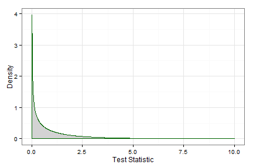

# Introduction

This is designed to help with problem 2 of Homework 8.  I'm assuming that they know that the MLE of a Gamma distribution is $\hat{\beta} = \frac{\bar{x}}{\alpha}$.

Also, I'd do part (a) by finding the ratio of the likelihood under the null to the likelihood for all $\beta$

\( \lambda (x) = \frac{sup(\beta = \beta_0) L(\beta | \textbf{x}, \alpha)}{sup(all \, \beta) L(\beta | \textbf{x}, \alpha)} \)

--- &radio
# Likelihood Under the Null

What is the likelihood under the null hypothesis?

1. \( \frac{1}{\Gamma(\alpha)^n \beta_0^{n\alpha}} \prod_{i = 1}^{n} x_i^{\alpha-1} exp(\sum_{i = 1}^{n} x_i / \hat{\beta}) \)
2. \( \frac{1}{\Gamma(\alpha)^n \beta_0^{n\alpha}} \prod_{i = 1}^{n} x_i^{\alpha-1} exp(\sum_{i = 1}^{n} x_i / \beta_0) \)
3. \( \frac{1}{\Gamma(\alpha)^n \hat{\beta}^{n\alpha}} \prod_{i = 1}^{n} x_i^{\alpha-1} exp(\sum_{i = 1}^{n} x_i / \hat{\beta}) \)

*** .hint
Recall that there is only one possible value of $\beta$ under the null.

*** .explanation
Under the null, you just plug in $\beta_0$ for $\beta$ in the likelihood.

--- &submitcompare1
# Likelihood Under the Alternative

What is the likelihood under the alternative

*** .explanation
Here, we just plug in $\hat{\beta}$ for $\beta$ in the likelihood.  So...

\(sup(all \, \beta) L(\beta | \textbf{x}, \alpha) =  \frac{1}{\Gamma(\alpha)^n \hat{\beta}^{n\alpha}} \prod_{i = 1}^{n} x_i^{\alpha-1} exp(\sum_{i = 1}^{n} x_i / \hat{\beta}) \)

---
# Likelihood Ratio Test

Find the ratio of these two, showing that it is equal to 

\( (\frac{\hat{\beta}}{\beta_0})^{n\alpha} \times exp(-\sum_{i=1}^{n} (\frac{1}{\beta_0} - \frac{1}{\hat{\beta}})) \)

--- &radio
# LRT Distribution

For a large sample, what distribution does this test statistic follow?

1. Normal
2. _Chi-Squared_
3. t
4. F

*** .hint
What happens to LRTs as $n \rightarrow \inf$?

*** .explanation
See Theorem (whatever Theorem it is)

--- &multitext
# LRT Distribution (Part 2)

1. What degrees of freedom does this distribution have?

*** .hint
How many constraints are there in your hypotheses?

*** .explanation
1. <span class = "answer">1</span>
There is one additional constraint in the null.

--- &radio
# Part (b) Null Hypothesis

What is the null hypothesis?

1. $\beta = 5$
2. $\alpha = 5$
3. $\beta = 44$
4. _$\beta = 12.2$_

*** .hint
Um...

*** .explanation
They assumed that $\beta = 12.2$ 

--- &multitext
# The test statistic

Round both to one decimal place.

1. What is $\hat{\beta}$?
2. What is the value of $\lambda (x)$

*** .hint
For $n = 1$, $\bar{x}$ is just the one observation.

*** .explanation
1. <span class = "answer">8.8</span>
$\hat{\beta} = 44.4 / \alpha$
2. <span class = "answer">0.2</span>
Plug in $\hat{\beta}$, $\beta_0$, and $\alpha$ in the LRT from before.

--- &submitcompare1
# Obtaining a p-value

A $\chi^2(1) distribution is plotted below.  Explain how you would find a p-value.


```r
library(ggplot2)
qplot(rchisq(10000, 1), geom = "density", colour = I("green"), fill = I("grey"), alpha = I(.5)) + 
  theme_bw() + 
  labs(x = "Test Statistic")
```



*** .explanation
Find the probability of observing a value of the $chi^2(1)$ distribution greater than 0.202.


